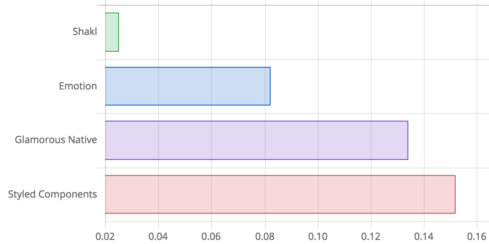

# Shakl

[](https://badge.fury.io/js/shakl) [](https://travis-ci.org/sonaye/shakl)


## Features

- Exposes basic [primitives](#using-primitives) such as `View`, `Text` and `Touchable`,
- Supports static and [dynamic styles](#dynamic-styles) (based on props).
- Supports component extension using [`extend()`](#extending-styles) and [`attrs()`](#custom-props).
- Supports component composition using [`clone()`](#wrapping-another-component) and [`child()](#wrapping-a-child)`.
- Supports [styling other style props](#multiple-style-props), e.g. `contentContainerStyle`, you can "truly" style any component.
- Uses regular inline styles under the hood (performance boost).
- [Works with React DOM](#usage-with-react-dom) too! same simple API, same benefits.
- No dependencies, all just React goodness.
- ~2 KB in size, with less than 100 lines of code.

### Benchmarks

Time required to create a simple styled component (in ms).



## Install

```bash
yarn add shakl
```

## Usage

#### Creating a styled component

```js
import styled from 'shakl';

const Foo = styled(View)({ flex: 1 });

<Foo />; // <View style={{ flex: 1 }} />
```

### Using primitives

By default, React Native's `View`, `Text`, and `TouchableOpacity` are exposed to you, they can be directly used.

```js
styled.View({ flex: 1 });
styled.Text({ color: 'blue' });
styled.Touchable({ padding: 10 });

// equivalent to
styled(View)({ flex: 1 });
styled(Text)({ color: 'blue' });
styled(TouchableOpacity)({ padding: 10 });
```

### Dynamic styles

```js
const Foo = styled.View(props => ({ padding: props.padded ? 10 : 0 }));

<Foo /> // <View style={{ padding: 0 }} />
<Foo padded /> // <View style={{ padding: 10 }} />
```

### Extending styles

`extend()` is analogous to `extend()` and `styled(StyledComponent)` in other libraries.

```js
const Title = styled.Text({ fontSize: 20 });
// <Text style={{ fontSize: 20 }} />

const BoldTitle = Title.extend({ fontWeight: 'bold' });
// <Text style={{ fontSize: 20, fontWeight: 'bold' }} />

const RedBoldTitle = BoldTitle.extend({ color: 'red' });
// <Text style={{ fontSize: 20, fontWeight: 'bold', color: 'red' }} />

const RedHeadline = styled(RedBoldTitle)({ fontSize: 28 }); // this works too
```

### Custom props

`attrs()` is analogous to `attrs()` and `withProps()` in other libraries.

```js
const Foo = styled.Text({ color: 'blue' }).attrs({ numberOfLines: 1 });
// <Text style={{ color: 'blue' }} numberOfLines={1} />;
```

### Wrapping another component

`clone()` is analogous to `withComponent()` in other libraries.

```js
const Button = styled.Touchable({ flex: 1 });
const HighlightedButton = Button.clone(TouchableHighlight);

// equivalent to
const HighlightedButton = props => (
  <TouchableHighlight style={{ flex: 1 }} {...props} />
);
```

### Wrapping a child

```js
const ButtonText = styled.Text({ color: 'blue' });
const ButtonContainer = styled.Touchable({ flex: 1 });
const Button = ButtonContainer.child(ButtonText);

// equivalent to
const Button = ({ children, ...props }) => (
  <TouchableOpacity style={{ flex: 1 }} {...props}>
    <Text style={{ color: 'blue' }}>{children}</Text>
  </TouchableOpacity>
);
```

### Multiple style props

```js
const Foo = styled(FlatList, { multi: true })({
  style: { flex: 1 },
  contentContainerStyle: { flex: 2 },
  anotherStyleProp: { flex: 3 }
});

// dynamic styles work too
const Foo = styled(FlatList, { multi: true })({
  style: ({ padded }) => ({ padding: padded ? 10 : 0 }),
  contentContainerStyle: ({ padded }) => ({ padding: padded ? 20 : 0 }),
  anotherStyleProp: ({ padded }) => ({ padding: padded ? 30 : 0 })
});
```

### Using refs

```js
const List = styled(FlatList)({ flex: 1 });

<List ref={this.list} />; // based on React's forwardRef API (16.3.0)

// this.list.scrollTo({ y: 0 })
// or this.list.current.scrollTo({ y: 0 }) (with React.createRef)
```

### Using a custom display name for debugging

Default display names are styled(View), styled(Text), styled(Touchable), styled(Component), etc.

```js
styled(View, { name: 'YetAnotherView' });
```

### Using propTypes and defaultProps

```js
const Foo = styled.View({ flex: 1 });

Foo.propTypes = { .. };
Foo.defaultProps = { .. };
```

### Usage with React DOM

Shakl is internally decoupled from React Native and can be used in the DOM.

```js
import styled from 'shakl';

// no exposed primitives however, feel free to add your own
const styled.div = styled('div');

const Foo = styled.div({ background: '#eee' });

<Foo />; // <div style={{ background: '#eee' }} />
```
