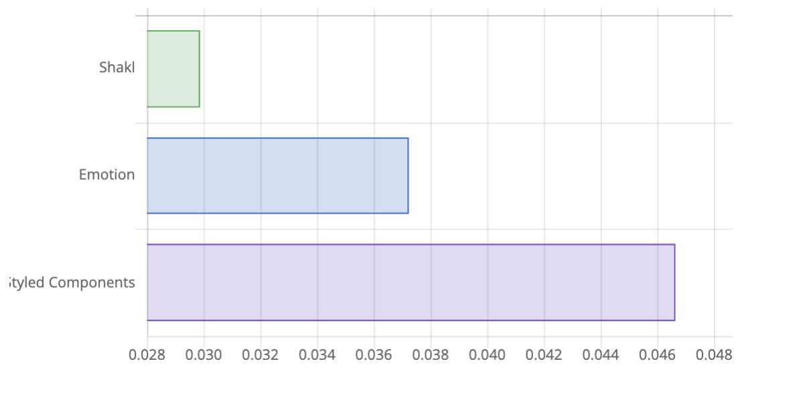

# Shakl

[](https://badge.fury.io/js/shakl) [](https://travis-ci.org/sonaye/shakl)


## Features

- Exposes basic [primitives](#primitives) such as `View`, `Text` and `Touchable`,
- Supports static and [dynamic styles](#dynamic-styles) (based on props).
- Supports component extension using [`extend()`](#extending-styles) and [`attrs()`](#custom-props).
- Supports component composition using [`withComponent()`](#wrapping-another-component) and [`withChild()`](#wrapping-a-child).
- Supports component [theming](#theming), based on React's new context API.
- Supports [styling other style props](#multiple-style-props), e.g. `contentContainerStyle`, you can "truly" style any component.
- Uses regular inline styles under the hood (performance boost).
- Works [with React DOM](#usage-with-react-dom) too, same simple API, same benefits.
- No dependencies, all just React goodness.
- ~2 KB in size, with less than 100 lines of code.

### Benchmark

Time required to create a simple styled component (in ms).



## Install

```bash
yarn add shakl
```

## Usage

### Creating a styled component

```js
import styled from 'shakl';

const Foo = styled(View)({ flex: 1 });

<Foo />; // <View style={{ flex: 1 }} />
```

### Primitives

By default, React Native's `View`, `Text`, and `TouchableOpacity` are exposed to you, they can be directly used.

```js
styled.View({ flex: 1 });
styled.Text({ color: 'blue' });
styled.Touchable({ padding: 10 });

// equivalent to
styled(View)({ flex: 1 });
styled(Text)({ color: 'blue' });
styled(TouchableOpacity)({ padding: 10 });
```

### Dynamic styles

```js
const Foo = styled.View(props => ({ padding: props.padded ? 10 : 0 }));

<Foo /> // <View style={{ padding: 0 }} />
<Foo padded /> // <View style={{ padding: 10 }} />
```

### Extending styles

```js
const Title = styled.Text({ fontSize: 20 });
// <Text style={{ fontSize: 20 }} />

const BoldTitle = Title.extend({ fontWeight: 'bold' });
// <Text style={{ fontSize: 20, fontWeight: 'bold' }} />

const RedBoldTitle = BoldTitle.extend({ color: 'red' });
// <Text style={{ fontSize: 20, fontWeight: 'bold', color: 'red' }} />

const RedHeadline = styled(RedBoldTitle)({ fontSize: 28 }); // this works too
```

### Custom props

```js
const Foo = styled.Text({ color: 'blue' }).attrs({ numberOfLines: 1 });
// <Text style={{ color: 'blue' }} numberOfLines={1} />;

// attrs({ .. }) only overwrites the `defaultProps` of the component
// for dynamic props however we can pass it a function

const MyText = styled.Text({ color: 'red' }).attrs(props => ({
  numberOfLines: props.oneLiner ? 1 : 3
}));

// equivalent to
<MyText /> // <Text style={{ color: 'red }} numberOfLines={3} />
<MyText oneLiner /> // <Text style={{ color: 'red }} numberOfLines={1} />
```

### Wrapping another component

```js
const Button = styled(TouchableOpacity)({ flex: 1 });
const HighlightedButton = Button.withComponent(TouchableHighlight);

// equivalent to
const Button = props => <TouchableOpacity style={{ flex: 1 }} {...props} />;

const HighlightedButton = props => (
  <TouchableHighlight style={{ flex: 1 }} {...props} />
);
```

### Wrapping a child

```js
const ButtonText = styled.Text({ color: 'blue' });
const Button = styled.Touchable({ flex: 1 }).withChild(ButtonText);

// equivalent to
const Button = ({ children, ...props }) => (
  <TouchableOpacity style={{ flex: 1 }} {...props}>
    <Text style={{ color: 'blue' }}>{children}</Text>
  </TouchableOpacity>
);

// to pass a ref to a child, use the `childRef` prop on the parent
// to pass custom props to a child, use `.withChild(Child, childProps)`
const CardText = styled.Text({ color: 'blue' });
const Card = styled.View({ flex: 1 }).withChild(CardText, { numberOfLines: 3 });

// equivalent to
const Card = ({ children, childRef, ...props }) => (
  <View style={{ flex: 1 }} {...props}>
    <Text ref={childRef} style={{ color: 'blue' }} numberOfLines={3}>
      {children}
    </Text>
  </View>
);

// you can also access parent props by passing a function `.withChild(Child, parentProps => childProps)`
const Card = styled.View({ flex: 1 }).withChild(CardText, parentProps => ({
  numberOfLines: parentProps.onLiner ? 1 : 3
}));

<Card />
// <View ..>
//   <Text ..>{children}</Text>
// </View>

<Card onLiner />
// <View ..>
//   <Text numberOfLines={1} ..>{children}</Text>
// </View>
```

### Theming

```js
import styled, { ThemeProvider } from 'shakl';

const Foo = styled.Text(props => ({ color: props.theme.primary })).withTheme();

const App = () => (
  <ThemeProvider theme={{ primary: 'blue' }}>
    <Foo />
  </ThemeProvider>
);

// to theme non-styled components you can directly use the HOC withTheme()
import { withTheme } from 'shakl';

const Bar = props => <Text>Primary color is {props.theme.primary}</Text>;

const ThemedBar = withTheme(Bar);
```

### Multiple style props

```js
const Foo = styled(FlatList, { multi: true })({
  style: { flex: 1 },
  contentContainerStyle: { flex: 2 },
  anotherStyleProp: { flex: 3 }
});

// dynamic styles work too
const Foo = styled(FlatList, { multi: true })({
  style: ({ padded }) => ({ padding: padded ? 10 : 0 }),
  contentContainerStyle: ({ padded }) => ({ padding: padded ? 20 : 0 }),
  anotherStyleProp: ({ padded }) => ({ padding: padded ? 30 : 0 })
});
```

### Using refs

```js
const List = styled(FlatList)({ flex: 1 });

<List ref={this.list} />; // based on React's forwardRef API (16.3.0)

// this.list.scrollTo({ y: 0 })
// or this.list.current.scrollTo({ y: 0 }) (with React.createRef)
```

### Using a custom display name for debugging

```js
styled(View, { name: 'YetAnotherView' });
```

Default display names are `styled(View)`, `styled(Text)`, `styled(Touchable)`, `styled(Component)`, etc.

### Using propTypes and defaultProps

```js
const Foo = styled.View({ flex: 1 });

Foo.propTypes = { .. };
Foo.defaultProps = { .. };
```

### Usage with React DOM

Shakl is internally decoupled from React Native and can be used in the DOM.

```js
import styled from 'shakl';

// no exposed primitives however, feel free to add your own
const styled.div = styled('div');

const Foo = styled.div({ background: '#eee' });

<Foo />; // <div style={{ background: '#eee' }} />
```

[](https://codesandbox.io/s/52kw0jrn94?module=%2Fsrc%2FExample.js)

### Testing with Jest

Since Shakl supports both React Native and the DOM, we need to explicitly tell Jest that we are testing for React Native, otherwise it will test against the DOM by default, which causes exposed primitives to fail (`.. shakl.default.View is not a function ..` error).

```js
// add the follwing to your Jest configuration when testing for React Native
"moduleNameMapper": {
  "shakl": "<rootDir>/node_modules/shakl/lib/rn.js"
}
```
